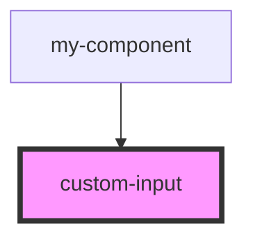

# custom-input

<!-- Auto Generated Below -->

## Properties

| Property            | Attribute            | Description | Type     | Default        |
| ------------------- | -------------------- | ----------- | -------- | -------------- |
| `id`                | `id`                 |             | `string` | `"default-id"` |
| `label`             | `label`              |             | `string` | `undefined`    |
| `type`              | `type`               |             | `string` | `undefined`    |
| `validationPattern` | `validation-pattern` |             | `any`    | `undefined`    |
| `value`             | `value`              |             | `string` | `undefined`    |

## Dependencies

### Used by

 - [my-component](../my-component)

### Graph

----------------------------------------------

*Built with [StencilJS](https://stenciljs.com/)*
